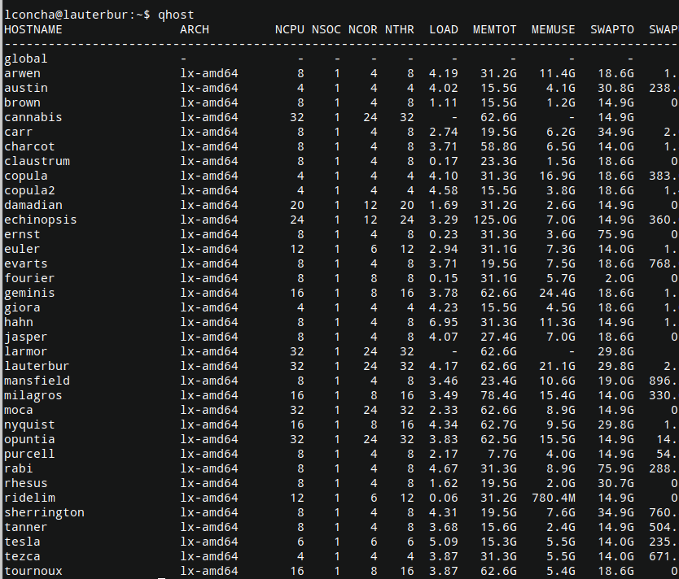
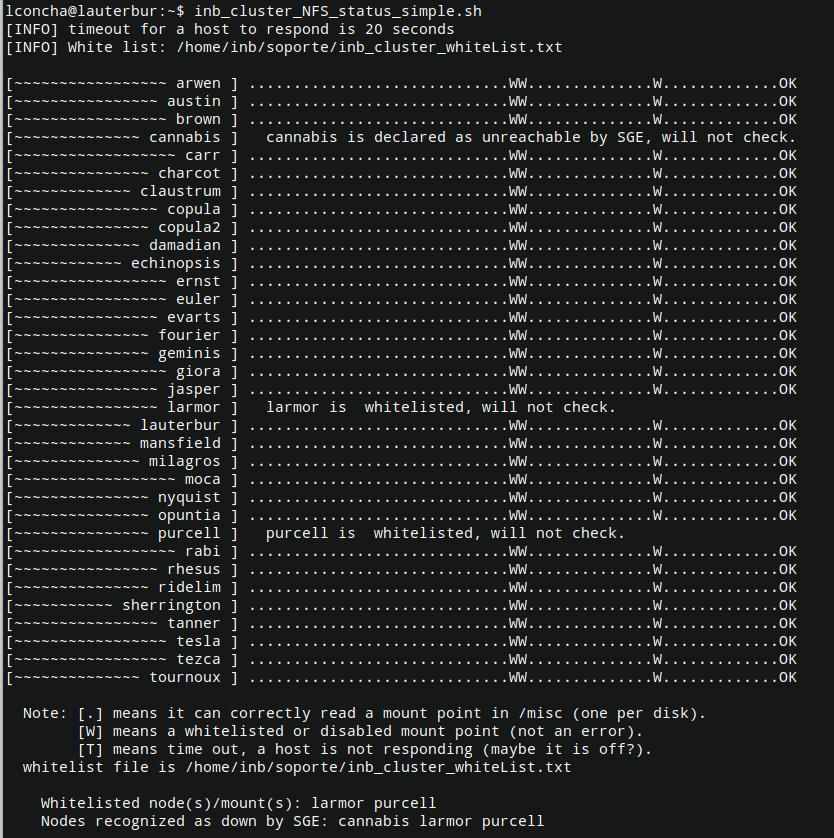

# Revisar hosts en Don Clusterio

Esto lo podemos revisar rápidamente en el [monitor web](http://penfield.inb.unam.mx/monitor.html) (se puede desde fuera del INB). 

También podemos ver el estado de los `ping` en e [monit](http://penfield:2812/) (solo en red INB).

Alternativamente, podemos usar distintos comandos para ver distintos tipos de información.

## Hosts que puede ver SGE
Esto lo vemos con el comando `qhost`. Lo puede hacer cualquier usuario, no hace falta ser `sudo`.

Los hosts que reportan `-` en LOAD y MEMUSE andan mal. Puede ser por dos razones:
1. Están apagadas. En ese caso reportan "unreachable" en un `ping` y error en [monit](http://penfield:2812/).
:construction_worker: Para corregirlo hay que ir físicamente a revisar si la PC está prendida, conectada a la red, y si tiene salida de red.

2. No está prendido el servidor de ejecución de SGE (`sgeexecd` en el cliente), y por lo tanto no los puede ver el servidor de administración de SGE (`sgeadmin` en `hahn`)
:construction_worker: En este caso debemos prender `sgeexecd`. 
2.1. Hacemos `ssh soporte@CLIENTE`. Revisamos si está prendido con `ps aux | grep sge`. Si solamente rporta el `grep` que acabamos de hacer, entonces no está prendido. Para prenderlo, usamos `sudo systemctl start sgeexecd.service`. [^1]
[^1]: Esto implica que sí existe el archivo `/etc/systemd/system/sgeexecd.service` que debió crearse durante la [instalación de SGE](https://hackmd.io/50k2ZcDVSQudUunpcKaqMw). Ya me he encontrado máquinas sin ésto (cannabis). Un `qhost` nuevo ya nos debe indicar su LOAD y MEMUSE, y un `ps aux` ya debe reportar que está corriendo `sge_execd`.

## Estado de NFS
Recordando que casi todas las máquinas exportan sus discos duros a las otras máquinas, quienes los montan en `/misc` (y viceversa), tenemos que revisar cliente por cliente para ver si puede ver todo lo que debe de ver en `/misc`. Hay un script para eso, `inb_cluster_NFS_status_simple.sh`. Esto lo puede correr cualquier usuario, sin ser sudo. Se recomienda haber usado `ssh-copy-id` a todas las máquinas para que funcione bonito, porque de lo contrario pide password para cada una. Este script siempre se está reportando en el [monitor web](http://penfield.inb.unam.mx/monitor.html).

En este script hay un renglón para cada máquina, quien intenta leer cada uno de los discos que deben estar en `/misc`. Si tiene éxito, pone un `.`. Si no lo logra después de _n_ segundos (timeout), pone una `T`. Si se conoce de antemano que ese mountpoint no va a estar accesible (por ejemplo, una máquina que estamos arreglando o sabemos que anda mal), entonces pone una `W` (whitelisted)[^2]
[^2]: Los nodos whitelisted se ponen en ese estado con el script `/home/inb/soporte/admin_tools/fmrilab_disable_host.sh` (hay que ser `sudo` y estar en `hahn`). El archivo whitelist está en `/home/inb/soporte/inb_cluster_whiteList.txt`

:construction_worker: Entonces, los que debemos revisar primero son los `T`. 
1. Podemos hacer ping a esa máquina?
2. Está conectada a la red?
3. Podemos hacer ssh?
4. Sabe exportar sus discos? Revisa `/etc/exports` en esa máquina. Si no estaba, no olvides ponerlos y después hacer `sudo exportfs -ra` para que se lea ese archivo y se exporten las cosas.
5. La máquina que no puede leer está en `netgroup` en `hahn`? Porque si no está ahí, entonces la cliente no quiere exportar a una PC que no conoce.
6. Reinicia el servidor NFS en la máquina Cliente con `sudo service nfs-kernel-server restart`
7. Reinicia `autofs` en la máquina Cliente con `sudo service autofs restart`.

